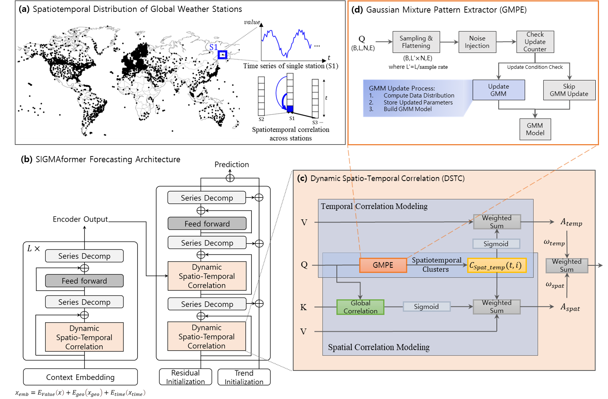

# SIGMAformer: A spatiotemporal gaussian mixture correlation transformer for multi-sensor weather fusion forecasting

### Proposed SIGMAformer framework

##### The proposed framework replaces the conventional attention mechanism with the DSTC module, which enhances spatiotemporal weather forecasting by leveraging GMM-based pattern extraction to compute and aggregate weighted temporal and spatial correlations.




### Highilights
##### -	Develop SIGMAformer for global weather via multi-station spatiotemporal correlation.
##### -	Gaussian-mixture pattern extraction (GMPE) guides adaptive temporal and spatial attention.
##### -	Attention maps reveal regional and temporal drivers, enhancing interpretability.
##### -	Captures short-term fluctuations, long-term trends, and near/far-station correlations.
##### -	Delivers state-of-the-art forecasts of global temperature and wind speed compared with baselines.

### Usage 

1. Global weather datasets can be obtained from [[Google Drive]](https://drive.google.com/file/d/1zCSqH-g3XXqRRwy8PYmoWzglj-W7FmFI/view?usp=sharing).

2. Install Pytorch and other necessary dependencies.
```
pip install -r requirements.txt
```
3. Train and evaluate model. We provide the experiment scripts under the folder ./scripts/. You can reproduce the experiment results as the following examples:

```
bash ./scripts/Global_Temp/SIGMAformer.sh
bash ./scripts/Global_Wind/SIGMAformer.sh
```
